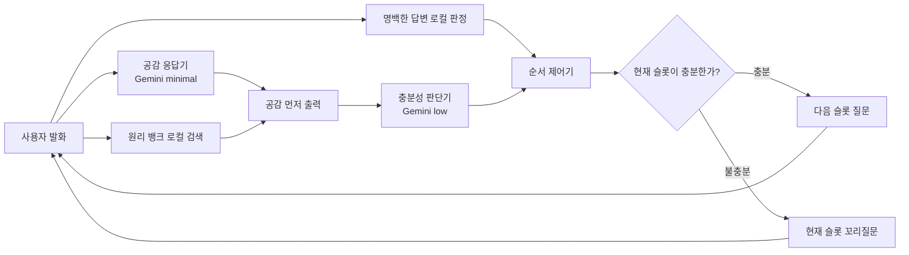

# Pume Chatbot

프메의 숲 상담 서비스에서 사용하는 **A 시리즈(공감 응답기와 판단기 분리)**만
독립시킨 터미널 챗봇입니다. 게임 화면, FastAPI, A/B 비교용 B 파이프라인은 포함하지
않습니다.

## 빠른 실행

Python 3.10 이상이 필요합니다.

```bash
git clone https://github.com/pume-org/chatbot.git
cd chatbot
python3 -m venv .venv
source .venv/bin/activate
pip install -r requirements.txt
cp .env.example .env
```

`.env`에 `GEMINI_API_KEY`를 입력한 뒤 실행합니다.

```bash
python -m chatbot --name 사용자
```

설치 후에는 콘솔 명령도 사용할 수 있습니다.

```bash
pip install -e .
pume-chatbot --name 사용자
```

Gemini를 호출하지 않고 흐름만 확인하려면 다음처럼 실행합니다.

```bash
python -m chatbot --mock
```

주요 옵션:

- `--debug`: 노드 상태, 모델 작업, thinking level과 소요 시간 출력
- `--no-stream`: 공감을 먼저 표시하지 않고 완성된 답변을 한 번에 출력
- `--probe`: 시작 시 Gemini endpoint 연결 확인
- 종료: `quit`, `exit`, `종료`

## 챗봇 파이프라인 요약

상담은 가치 선택, 라포 형성, 슬롯 상담, 최종 빙산 리포트 순서로 진행됩니다. 일반
상담 턴에서는 공감 응답기와 판단기의 책임을 분리합니다.



### 1. 공감 응답기

- 사용자의 마지막 발화에 대한 짧은 공감만 생성합니다.
- 질문이나 충분성 판단은 하지 않습니다.
- Gemini native `minimal` thinking을 사용합니다.
- 결과가 준비되면 판단 완료를 기다리지 않고 터미널에 먼저 출력합니다.

### 2. 원리 뱅크

- 30개 상담 원리와 검수된 `named_pattern`, `social_context` 표현을 사용합니다.
- SQLite는 시작 시 한 번 읽고, 상담 턴에서는 메모리 스냅샷만 검색합니다.
- 위기·사별·폭력·의료·법률 맥락이나 단순 사실 답변에는 설명을 생략합니다.
- 같은 설명이 연속해서 반복되지 않도록 쿨다운을 적용합니다.

### 3. 충분성 판단기

- 현재 질문 대상 슬롯이 충분한지 판정합니다.
- 한 답변에 함께 나온 다른 슬롯 정보를 최대 2개까지 저장합니다.
- `모르겠어요`처럼 명시적으로 모른다는 답은 `unknown`으로 닫고 다음으로 넘어갑니다.
- 기간과 빈도가 함께 나온 답처럼 명백한 경우는 LLM 없이 로컬 규칙으로 처리합니다.
- Gemini `low` reasoning을 사용합니다.

### 4. 순서 제어기

- 모델이 아닌 코드가 현재 슬롯과 다음 질문을 결정합니다.
- 충분하면 다음 슬롯으로 이동하고, 부족하면 슬롯에 고정된 꼬리질문을 한 번 합니다.
- 같은 슬롯을 계속 반복해서 묻지 않도록 재질문 횟수를 제한합니다.

### 5. 호출 순서와 지연 정책

하나의 Gemini API 용량을 공유할 때 두 호출을 동시에 보내면 큐잉으로 더 느려질 수
있습니다. 기본 설정은 공감을 먼저 생성·출력한 뒤 사용자가 읽는 동안 판단기를
호출합니다. `ANALYZER_API_ENABLED=true`이고 실제로 별도 API key·프로젝트가 설정된
경우에만 공감과 판단을 병렬 실행합니다.

응답기가 늦어지면 검수된 공감 fallback을 먼저 표시합니다. 판단기 실패나 timeout은
안전한 고정 질문으로 대체하며, `--debug`에서 fallback과 모델 호출 상태를 확인할 수
있습니다.

## 전체 상담 단계

1. 27개 가치 중 5개 선택
2. 인사·기분·방문 과정·유입 경로로 라포 형성
3. 상황, 감정, 생각, 원인, 행동, 기간·빈도, 일상 영향, 대인관계, 과거 시도,
   목표, 자신에게 하고 싶은 말 슬롯 관리
4. 충분성 검사와 코드 기반 다음 질문 선택
5. 선택 가치와 상담 내용을 통합
6. 사티어 빙산 모델 형식의 최종 리포트 생성

명백한 자해·자살 위험 표현은 Gemini로 전달하지 않고 고정된 긴급 도움 안내로
우회하며 일반 상담을 종료합니다. 이는 임상 진단기가 아니라 보수적인 문자열 기반
안전장치입니다.

## 프로젝트 구조

```text
chatbot/
├── cli.py                    # 터미널 입출력
├── session.py                # 독립 세션과 공감 세그먼트 전달
├── graph.py                  # A 시리즈 LangGraph
├── baseline_nodes.py         # 공감·판단·질문·리포트 노드
├── llm.py                    # Gemini/Vertex 어댑터와 모델 trace
├── delivery.py               # 공감 선출력과 연결 발화 제어
├── state.py                  # 슬롯과 세션 상태
├── principle_*.py/json       # 원리 뱅크 저장·검색
└── safety.py                 # 위기 발화 우회
```

## 설정

API key 방식:

```dotenv
GEMINI_AUTH_MODE=api_key
GEMINI_API_KEY=...
GEMINI_MODEL=gemini-3.5-flash
```

Vertex ADC 방식:

```bash
gcloud auth application-default login
```

```dotenv
GEMINI_AUTH_MODE=vertex_adc
GOOGLE_CLOUD_PROJECT=your-project-id
GOOGLE_CLOUD_LOCATION=global
GEMINI_MODEL=gemini-3.5-flash
```

세부 timeout, analyzer 분리 API, 원리 뱅크 설정은 `.env.example`에 정리되어 있습니다.
실제 `.env`, SQLite와 대화 로그는 Git에 포함하지 않습니다.

## 검증

```bash
pip install -r requirements-dev.txt
pytest
printf 'quit\n' | python -m chatbot --mock
```

모의 응답은 기능 검증용이며 실제 모델의 품질·지연 비교 결과로 사용하면 안 됩니다.

## 출처

이 저장소의 A 시리즈는 `pume-org/frontend`의 상담 백엔드 커밋 `d28207a`에서
독립 실행 형태로 추출했습니다. 원본 상담 형식의 기준은 `juminsuh/chatbot`
업스트림 커밋 `e065de5`입니다.
