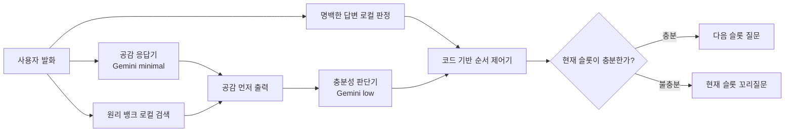

# Pume Counseling Village

프메의 숲 3D 게임, **프바오와 나 찾기** 상담 화면, Gemini 기반 A 시리즈
상담 파이프라인과 독립 실행 가능한 터미널 챗봇을 함께 관리하는 모노레포입니다.
실제 상담 화면은 공감 응답기와 충분성 판단기를 분리한 A 파이프라인만 사용합니다.

## Repository layout

```text
.
├── backend/                 # FastAPI, 서비스용 LangGraph, STT/TTS 어댑터
│   ├── app/                 # HTTP API
│   ├── counsel/             # 서비스 상담 그래프·프롬프트·원리 뱅크
│   └── tests/               # 백엔드 단위·통합 테스트
├── frontend/                # Next.js 3D 마을과 실제 상담 화면
├── chatbot/                 # A 시리즈 독립 터미널 패키지
├── tests/                   # 독립 챗봇 계약 테스트
└── docs/                    # 상담 구조와 원리 뱅크 문서
```

`backend/counsel`은 웹 서비스 통합본이고, 루트 `chatbot` 패키지는 같은 A 시리즈를
터미널에서 독립 검증할 수 있도록 분리한 기준본입니다.

## Local setup

Python 3.10 이상과 Node.js 20 이상이 필요합니다.

### Backend

```bash
python3 -m venv .venv
source .venv/bin/activate
pip install -r backend/requirements-dev.txt
cp backend/.env.example backend/.env
cd backend
../.venv/bin/python -m uvicorn app.server:app --host 127.0.0.1 --port 8000
```

### Frontend

다른 터미널에서 실행합니다.

```bash
cd frontend
cp .env.example .env.local
npm ci
npm run dev
```

- 게임·상담 화면: <http://127.0.0.1:3000>
- FastAPI: <http://127.0.0.1:8000>

프런트의 `/api/*` 요청은 `PUME_API_BASE_URL`로 지정한 FastAPI 서버에 전달됩니다.

### Standalone chatbot

게임이나 FastAPI 없이 A 시리즈 상담 흐름만 터미널에서 실행할 수 있습니다.

```bash
pip install -r requirements.txt
cp .env.example .env
python -m chatbot --name 사용자
```

Gemini를 호출하지 않는 흐름 검증은 `python -m chatbot --mock`으로 실행합니다.
`--debug`, `--no-stream`, `--probe` 옵션도 지원합니다.

## Counseling pipeline



- 공감 응답기는 질문이나 충분성 판정을 하지 않고 첫 문장을 빠르게 제공합니다.
- 판단기는 현재 슬롯과 답변에 함께 포함된 다른 슬롯 최대 2개를 구조화합니다.
- `모르겠어요`는 `unknown`으로 닫고, 기간·빈도처럼 명백한 답은 로컬 규칙으로
  처리합니다.
- 순서 제어기는 모델이 아니라 코드가 담당하며 재질문 횟수를 제한합니다.
- 원리 뱅크는 시작 시 메모리 스냅샷을 만들고 턴 중에는 로컬 검색만 수행합니다.
- 별도 analyzer API가 구성된 경우에만 두 Gemini 호출을 병렬로 실행합니다.

느린 응답 fallback은 사용자의 상태를 부정적으로 단정하지 않는 중립적인 공감 문구를
사용합니다. 가치 5개 선택이 끝나면 이전 가치 프롬프트를 반복하지 않고 첫 라포
인사로 바로 전환합니다.

## Voice

- STT: 로컬 whisper.cpp 모델과 ffmpeg
- 발화 종료: 브라우저 Silero VAD
- TTS: GPT-SoVITS raw PCM 스트림과 AudioWorklet 연속 재생

`목소리 대화 시작`을 한 번 누르면 `VAD → STT → Gemini → TTS`가 순환합니다.
프바오가 말하는 동안에는 마이크를 닫고, 재생 종료 후 자동으로 다시 듣는 반이중
방식입니다. 음성 가중치와 로컬 GPT-SoVITS 작업공간은 저장소에 포함하지 않습니다.

## Verification

```bash
# 독립 챗봇
./.venv/bin/pytest tests
printf 'quit\n' | ./.venv/bin/python -m chatbot --mock

# 서비스 백엔드
./.venv/bin/pytest backend/tests

# 프론트엔드
cd frontend
npm run lint
npm test
npm run build
npx playwright test
```

실제 Gemini 연결 검증은 `backend/scripts/smoke_live.py`와
`backend/scripts/smoke_full_session.py --arm baseline`을 사용합니다.

## Documentation and lineage

- [상담 파이프라인 상세 구조](docs/counseling-architecture.md)
- [원리 뱅크 v1](docs/principle_bank_v1.md)
- [속담·사자성어 후보 검토](docs/principle_reference_candidates_100.md)

웹 서비스 기준 이력은 `pume-org/frontend`의 `d28207a`, 독립 A 시리즈 기준 이력은
`mgusdn/chatbot`의 `1e72e75`, 최신 중립 말투 개선은 `218c390`에서 통합했습니다.
원본 상담 형식의 기준은 `juminsuh/chatbot` 업스트림 `e065de5`입니다.
